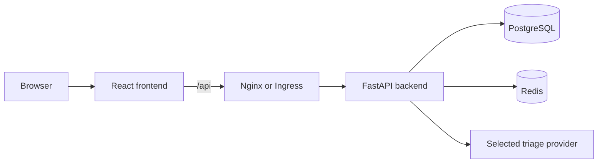

# CivicPulse 🏙️

> A full-stack civic complaint management system with AI-powered triage.

**Team:** Zubair & Sami | **Course:** Software Construction & Design | **Duration:** 2 weeks

---

## Architecture



The browser calls the relative `/api` path. In Docker Compose, Nginx proxies it to the internal backend service; in Kubernetes, Ingress routes it to the backend Service. PostgreSQL and Redis are not exposed to the browser.

## Frontend Features

- **Submit:** validates fields against the backend contract and displays the returned AI triage result.
- **Dashboard:** server-driven filters, page-based navigation, confirmed lifecycle advancement, and visible 409 conflict feedback.
- **Statistics:** aggregate complaint cards and the API's `X-Cache: HIT` or `MISS` signal.
- **Resilience:** typed API errors, structural loading panels, accessible controls, and an error boundary.

## Tech Stack

| Layer | Technology |
|-------|-----------|
| Backend | FastAPI (Python), PostgreSQL, Redis |
| AI Triage | Groq LLM, Ollama, Rule-based, Simulated |
| Frontend | React 18 + Vite + TypeScript |
| Infra | Docker, Kubernetes (kind/k3d), GitHub Actions |

---

## Quick Start

```bash
# Clone the repo
git clone https://github.com/Zubairilyas1/Civic-Pulse.git
cd Civic-Pulse

# Copy env file and fill in your keys
cp .env.example .env

# Start everything
docker compose up --build
```

> App available at http://localhost:3000 | API at http://localhost:8000/docs

### Frontend development and verification

```bash
cd frontend
npm ci
npm run dev
npm run lint
npm run build
npm test
```

The frontend loads a public runtime `/config.js` and defaults to `/api`. Its production container generates that file from `API_BASE_URL` at startup, so an image can be built once and deployed to multiple environments.

---

## Project Structure

```
civicpulse/
├── backend/          # FastAPI app (routes, services, repositories, providers)
├── frontend/         # React + Vite + TypeScript
├── k8s/              # Kubernetes manifests (base + overlays)
├── .github/workflows # CI/CD pipelines
├── docs/             # ADRs, RUNBOOK, ENGINEERING-NOTES, evidence
├── load/             # k6 load test script
└── scripts/          # Utility scripts
```

## API Contract

| Method | Endpoint | Purpose |
| --- | --- | --- |
| `POST` | `/api/complaints` | Submit a complaint; title 5–150 chars, description 10–2,000 chars, location 3–200 chars |
| `GET` | `/api/complaints` | List with optional `category`, `priority`, `status`, `skip`, and `limit` filters |
| `GET` | `/api/complaints/{id}` | Retrieve one complaint |
| `PATCH` | `/api/complaints/{id}/status` | Change lifecycle status; invalid transitions return `409` |
| `GET` | `/api/stats` | Retrieve aggregates and an `X-Cache` header |
| `GET` | `/api/meta/providers` | Inspect triage provider metadata |
| `GET` | `/api/health`, `/api/ready` | Liveness and readiness checks |

## Operations

Run the repository pre-flight audit from the root:

```bash
python scripts/check_submission.py
```

See the [RUNBOOK](./docs/RUNBOOK.md) for deployment, verification, logs, triage failure handling, cache behavior, and Kubernetes rollback. Production deployment uses immutable Git SHA image tags; see [ADR 0003](./docs/adr/0003-deploy-by-sha.md).

---

## Documentation

- [Project Plan](./PROJECT_PLAN.md)
- [Architecture Decision Records](./docs/adr/)
- [Engineering Notes](./docs/ENGINEERING-NOTES.md)
- [Runbook](./docs/RUNBOOK.md)
- [AI Usage Disclosure](./docs/AI-USAGE.md)
